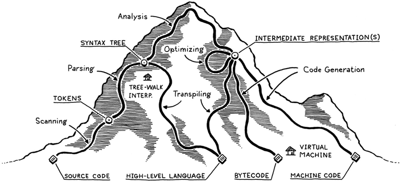
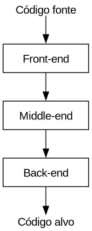
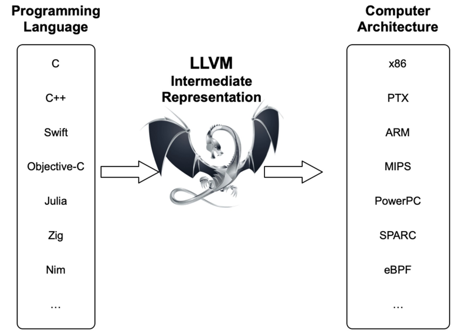
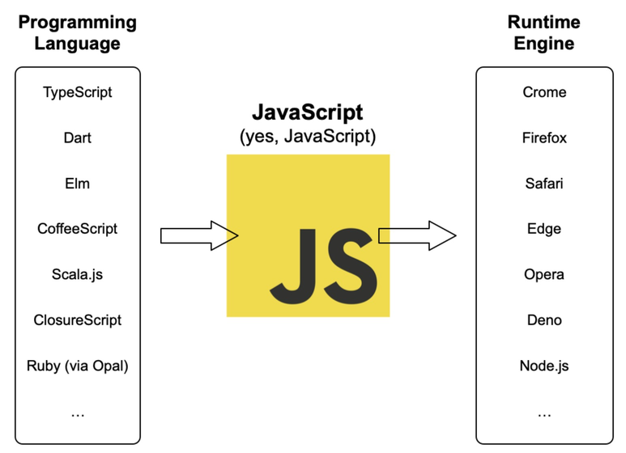
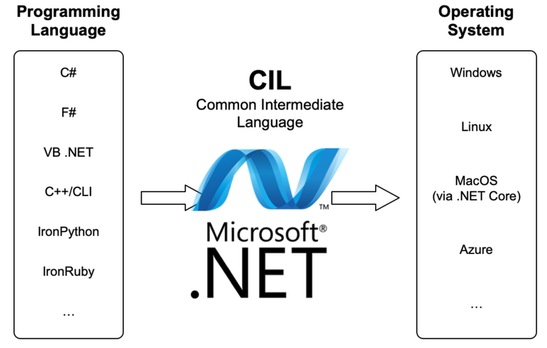
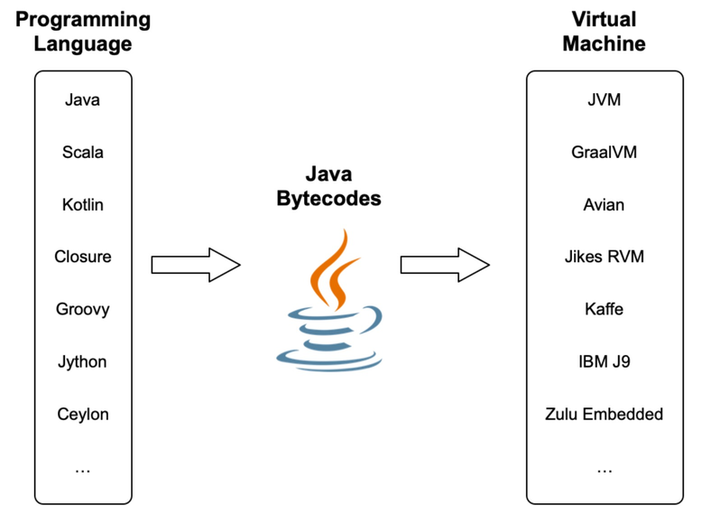

# Objetivos

## Objetivos

- Apresentar a importância da construção de compiladores na formação de um
  cientista da computação.
- Apresentar a ementa, critérios de avaliação e bibliografia da disciplina.

## Objetivos

- Apresentar a visão geral de um compilador.

# Compiladores

## Como executamos programas?

- Três técnicas principais
  - Interpretação
  - Compilação
  - Virtualização.

## Interpretação

- Código fonte é representado como uma estrutura de dados e o intepretador
  executa o programa diretamente.
- Interpretador é responsável pela execução do programa e de sua interação com o
  S.O.

## Compilação

- Código fonte é traduzido para uma nova linguagem.
- Código alvo pode ser uma linguagem de alto nível (transpilação).
- Código alvo pode ser uma linguagem de baixo nível (compilação).

## Virtualização

- Código fonte é traduzido para uma linguagem de baixo nível, não diretamente
  entendida pelo hardware.
- Normalmente, chamado de bytecode.
- Intepretadores mais eficientes.

## Visão geral (montanha)

## Escalando a montanha

- Análise Léxica: Dividir o código em **tokens**.
  - Eliminar comentários e espaços em branco.

## Escalando a montanha

- Análise sintática: Organiza a sequência de tokens em sua estrutura gramatical.
  - Produz uma árvore de sintaxe abstrata.

## Escalando a montanha

- Análise semântica: Verifica se a árvore produzida pelo analisador sintático
  atende restrições semânticas.
  - Todos os símbolos foram declarados?
  - Argumentos de funções possuem a aridade e tipo corretos?

## Escalando a montanha

- Intepretador: executa o código diretamente a partir da árvore de sintaxe.
  - Não há geração de código
  - Comum em linguagens dinamicamente tipadas, como Python.

## Escalando a montanha

- "Transpilador": converte a árvore de sintaxe para outra linguagem de alto
  nível.
  - Ideal para permitir independência de plataformas.
  - Exemplo: Typescript.

## Escalando a montanha

- Geração de código intermediário: código de baixo nível independente de
  plataforma.
  - Utilizado para otimizações independentes de hardware.

## Escalando a montanha

- Otimização de código.
  - Otimização de consumo de memória, tempo de execução, tamanho de código,
    etc...

## Escalando a montanha

- Geração de código: tradução da representação intermediária para o código de
  máquina, diretamente executável pelo hardware.

## Escalando a montanha

- Virtualização: geração de código para máquinas virtuais como a JVM / EVM.
  - Diferentes plataformas podem executar o mesmo programa utilizando VMs para a
    plataforma.

# Motivação

## Porque estudar compiladores?

- Desenvolver um compilador permite consolidar conhecimentos de:
  - Teoria da computação (autômatos e gramáticas)

## Porque estudar compiladores?

- Desenvolver um compilador permite consolidar conhecimentos de:
  - Engenharia de software (testes e arquitetura de software)

## Porque estudar compiladores?

- Desenvolver um compilador permite consolidar conhecimentos de:
  - Arquitetura de computadores (conhecer detalhes do alvo de compilação)

## Porque estudar compiladores?

- Possivelmente, o primeiro artefato de software complexo produzido por
  estudantes de graduação.

## Porque estudar compiladores?

- Compiladores aparecem em toda parte!
  - Navegadores web (JavaScript e WebASM)

## Porque estudar compiladores?

- Compiladores aparecem em toda parte!
  - Monitoramento do Kernel Linux (eBPF)

## Porque estudar compiladores?

- Compiladores aparecem em toda parte!
  - Várias aplicações possuem linguagens para customização.
- Exemplos:
  - VBA, elisp, Lua

## Porque estudar compiladores?

- Projeto de compiladores envolve problemas difíceis:
  - Executam várias tarefas e devem ser eficientes.

## Porque estudar compiladores?

- Projeto de compiladores envolve problemas difíceis:
  - Responsáveis por bom uso de uma linguagem.

## Porque estudar compiladores?

- Projeto de compiladores envolve problemas difíceis:
  - Devem ocultar detalhes de arquitetura e SO de desenvolvedores.

## Porque estudar compiladores?

- Provavelmente, uma das áreas mais consolidadas da ciência da computação!

## Porque estudar compiladores?

- Vários pesquisadores da área foram agraciados com o Turing Award!
  - John Backus, Barbara Liskov, Niklaus Wirth, Edsger Djikstra, Robin Milner e
    C.A. Hoare.

## Porque estudar compiladores?

- A área de linguagens de programação, apesar de teórica, possui demanda de
  vagas!

## Porque estudar Compiladores?

- Áreas de atuação: Compiladores.
  - Cadence contrata Engenheiros de compiladores para desenvolvimento de
    compiladores de modelos de IA.
  - Time de compiladores atua no escritório de BH.

## Porque estudar Compiladores?

- Ferramentas de análise estática de código e teste automatizado.
- Verificação formal de aplicações WEB3 (contratos inteligentes).
- Segurança de software.

## Porque estudar compiladores?

- Como determinar se o bug em seu código está presente em seu programa fonte ou
  foi inserido durante o processo de compilador?

## Porque estudar compiladores?

- Correção de um compilador é um problema sério!

- Como determinar se um compilador é ou não correto?
  - Código produzido pelo compilador deve ter o mesmo significado que o código
    fonte original.

## Porque estudar compiladores?

- Qual o problema da compilação?

- Imagine a situação:
  - Dado um programa fonte P, o compilador produz o código alvo E, que é
    equivalente a P, exceto que E imprime um "Hello world" adicional.

## Porque estudar compiladores?

- Pode-se pensar, um print adicional é inócuo...
  - Depende da informação impressa!
  - Informações: endereços de memória restritos, versões de software
    instalado...
  - Executar programas na máquina host durante a execução

## Porque estudar compiladores?

- Pesquisa em compiladores:
  - Como produzir código mais eficiente? Otimização de código.
  - Como garantir que um compilador é correto? Verificação e teste.
  - Criar novas linguagens e seus compiladores.

## Porque estudar compiladores?

- Pesquisa realizada no DECOM / UFOP
  - Novos algoritmos para análise sintática / léxica.
  - Verificação e teste de programas.
  - Análise de código fonte.

## Porque estudar compiladores?

- Novos algoritmos para análise sintática / léxica
  - Terminação de análise sintática usando PEGs.
  - Análise léxica utilizando derivadas.
  - Análise sintática de formatos binários usando PEGs.

## Porque estudar compiladores?

- Verificação e teste de programas.
  - Filtros de pacotes e extensões de Kernel (eBPF).
    - Teste automatizado de programas.
    - Verificação formal baseada em assistente de provas.

## Porque estudar compiladores?

- Verificação e teste programas.
  - Análise de complexidade assintótica de tempo.
- Análise de código fonte
  - Desenvolvimento de bibliotecas para manipulação de código.

## Porque estudar compiladores?

- Desenvolvimento de contratos inteligentes
  - Software responsável por transações em blockchain.
  - Projeto Core Solidity: Nova linguagem para Ethereum.
- Problemas em aberto:
  - Ferramentas para teste e verificação formal.

# Estrutura de um compilador

## Estrutura geral

- Estrutura geral de um compilador

## Front-end de um compilador

- Responsável pela análise do código.
- Produz uma representação intermediária para geração de código.

## Middle-end de um compilador

- Responsável por otimizações independentes de arquitetura.
  - Constant folding: substituir 3 + 4 por 7 no código.
  - Dead code elimination: eliminar código que nunca é executado.
  - Loop unrolling: eliminar laços para reduzir custo de desvios.

## Back-end de um compilador

- Responsável por otimizações dependentes do hardware.
  - Alocação de registradores: como usar registradores da melhor maneira?
  - Escalonamento de instruções: qual a ordem de instruções para melhor
    eficiência?
  - Otimizações específicas de arquitetura: usar vectorização, múltiplos
    núcleos.

## Porque essa arquitetura?

- Um mesmo front-end pode suportar diferentes middle-ends, sem modificações na
  linguagem fonte.
- Um mesmo middle-end pode suportar diferentes arquiteturas.
- Separação permite que desenvolvimento seja focado em problemas de cada
  componente.

## Exemplos

## Exemplos

## Exemplos

## Exemplos

# Ementa

## Ementa

- Introdução ao processo de compilação e interpretação

- Análise léxica

- Análise sintática

- Análise semântica e geração de código intermediário.

# Pré-requisitos

## Pré-requisitos

- Essa disciplina faz uso **INTENSO** de conceitos:
  - BCC222 Programação Funcional
  - BCC244 Teoria da Computação

## Pré-requisitos

- BCC222 Programação funcional
  - Tipos de dados algébricos e casamento de padrão.
  - Polimorfismo paramétrico e sobrecarga.
  - Mônadas, functores e functores aplicativos.

## Pré-requisitos

- No curso utilizamos diversas bibliotecas Haskell.

- Utilize o Hoogle, para pesquisar sobre funções.
  - <https://hoogle.haskell.org/>

## Pré-requisitos

- BCC244 Teoria da computação
  - Autômatos finitos determinísticos, não determinísticos e expressões
    regulares.
  - Gramáticas livres de contexto, ambiguidade e manipulação de gramáticas.

# Bibliografia

## Bibliografia

- Construindo Compiladores. Cooper, Keith D. ; Torcson, Linda

- Compiladores: Princípios, técnicas e ferramentas. Aho, Alfred; Lam, Monica;
  Sethi, Ravi; Ullman, Jeffrey.

- Modern compiler implementation in ML. Appel, Andrew.

# Materiais de apoio

## Materiais de apoio

- Slides e código de exemplo serão disponibilizados no seguinte repositório
  online.
- Notas de aula em elaboração.

# Critérios de Avaliação

## Critérios de Avaliação

- Duas avaliações no valor de 7,0 pontos.

- Exercícios de programação no valor 3,0 pontos.

## Critérios de Avaliação

- Exercícios de programação
  - Desenvolvimento incremental de uma linguagem de programação simples
- Implementação
  - Compilação para WASM e C.
  - Interpretador.

## Critérios de Avaliação

- Datas de entregas de exercícios serão postadas na plataforma Moodle.
  - Entrega via Github classroom.

- Trabalhos pode ser feito individualmente ou em dupla.
  - Uso de IA generativa: Resolução CONPEP 144.

- Nota ponderada por percentual obtido em questões de programação em avaliações
  teóricas.

## Critérios de Avaliação

- Data avaliação 1: 11/05/2026
- Data avaliação 2: 20/07/2026

# Exame especial

## Exame especial

- Mínimo de 75% de frequência e nota inferior a 6,0.

- Exame especial parcial para alunos que perderam uma avaliação.

  - Envolverá tarefas de codificação e atividades teóricas (em papel).

- Detalhes: Resolução CEPE 2880 de 05/2006

## Exame especial

- Data do exame especial: 27/07/2026

# Software

## Software

- Trabalhos e códigos de exemplo serão desenvolvidos utilizando Haskell.

- Utilizaremos diversas bibliotecas da linguagem Haskell.

## Software

- Para evitar problemas de compatibilidade, será fornecido um ambiente de
  desenvolvimento baseado em Docker.

- Trabalhos que apresentarem qualquer erro de compilação neste ambiente, não
  serão considerados para correção.

# Outras Informações

## Informações

- Toda informação da disciplina será disponibilizada na plataforma Moodle.

- Email: rodrigo.ribeiro@ufop.edu.br

## Atendimento

- Horários de atendimento
  - Segunda-feira: 16:00 - 17:00h
- Gentileza, agendar por e-mail atendimentos.

## Finalizando

- Tenhamos todos um excelente semestre de trabalho!
