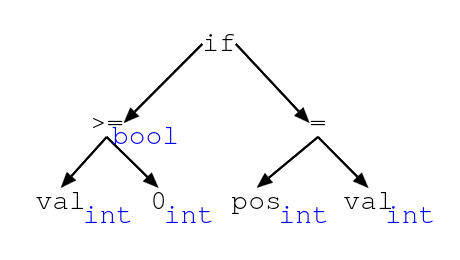
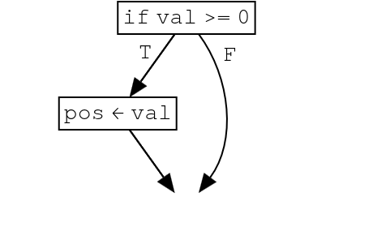

# O que é um Compilador?

## Definição

- Um compilador **traduz** um programa de uma linguagem de origem para uma de destino
- A linguagem de origem é projetada para ser **compreensível por humanos**

## Definição

- A linguagem de destino é projetada para **execução eficiente por hardware**
- A tradução é desafiadora quando as linguagens são muito diferentes

## Definição

- Compiladores são sistemas complexos que exigem técnicas sofisticadas

## Exemplos de Compilação

- C/C++ → código assembly x86-64
- Java → bytecode JVM (*just-in-time*: JVM → código nativo)

## Exemplos de Compilação

- Haskell → código assembly via GHC
- TypeScript → JavaScript
- LLVM IR → código de máquina para diversas arquiteturas

## Compiladores vs. Interpretadores

| | Compilador | Interpretador |
|---|---|---|
| Execução | Traduz antes de executar | Executa diretamente |
| Desempenho | ~10× mais rápido | Mais lento |

## Compiladores vs. Interpretadores

| | Compilador | Interpretador |
|---|---|---|
| Energia | Menos consumo | Mais consumo |
| Tempo de compilação | Pode ser alto | Nenhum |

## Compiladores vs. Interpretadores

- Compilar faz sentido para programas executados **muitas vezes**
- Para execução única, interpretar pode ser mais conveniente

## Por que Compiladores São Difíceis?

- Código-fonte: legível, estruturado, redundante, favorece análise
- Código-alvo: compacto, eficiente, pouco legível, descarta estrutura de alto nível

## Por que Compiladores São Difíceis?

- A diferença entre as duas representações é enorme
- Mais importante que desempenho é a **correção** do compilador
- Erros introduzidos pelo compilador são extremamente difíceis de depurar

## Correção de Compiladores

- É possível definir matematicamente o que significa um compilador estar correto
- Requer semântica formal para linguagem de origem **e** de destino

## Correção de Compiladores

- Vários compiladores foram desenvolvidos com **provas de correção**
- Exemplo: CompCert — compilador C com prova formal verificada por computador
- Nossa abordagem: especificar cada fase com precisão

# Fases de um Compilador

## Visão Geral do Pipeline

1. **Análise léxica** — caracteres → tokens
2. **Análise sintática** — tokens → árvore sintática
3. **Análise semântica** — verificação de tipos e de contexto

## Visão Geral do Pipeline

4. **Geração de código intermediário** — árvore → representação intermediária
5. **Otimização** — melhora o código intermediário
6. **Geração de código** — representação intermediária → código-alvo

## A Ideia Central: Dividir para Conquistar

- Em vez de traduzir diretamente do código-fonte para código de máquina
- Definimos uma sequência de **fases** e **representações intermediárias**

## A Ideia Central: Dividir para Conquistar

- Cada fase transforma o programa para uma representação mais próxima do destino
- Cada representação intermediária é projetada para a conveniência da fase atual

## Programa de Exemplo

```
if (val >= 0) pos = val
```

- Vamos acompanhar essa instrução pelas fases do compilador
- Começamos com uma sequência de bytes/caracteres
- Terminamos com instruções de máquina

## Análise Léxica

{width=70%}

- Divide o texto em **tokens** (as "palavras" do programa)
- Descarta espaços em branco e comentários
- Exemplo: `if`, `(`, `val`, `>=`, `0`, `)`, `pos`, `=`, `val`
- Detecta erros léxicos: caracteres inválidos, identificadores malformados

## Análise Sintática

{width=40%}

- Verifica se os tokens formam uma sequência sintaticamente válida
- Produz uma **Árvore Sintática Abstrata (AST)**

## Análise Sintática

{width=40%}

- Captura a estrutura hierárquica do programa
- Descarta elementos puramente sintáticos (como parênteses)

## Análise Semântica

{width=40%}

- Completa a tarefa de verificar se o código representa um programa válido
- Realiza **verificação de tipos** e verificações de contexto

## Análise Semântica

{width=40%}

- Coleta informações adicionais sobre o programa
- Enriquece a AST com **anotações** (tipos, referências a declarações)

## Geração de Código Intermediário

{width=40%}

- Produz uma **Representação Intermediária (RI)**
- Exemplo: grafo de fluxo de controle

## Seleção de Instruções

```
     cmp val, 0       -- compara val com 0
     jl L1            -- salta se menor
     mov pos, val     -- pos = val
L1:
```

- Traduz a RI para instruções assembly abstrato
- Variáveis ainda são tratadas como registradores virtuais

## Alocação de Registradores e Otimização

```
     cmp rax, 0
     jl L1
     mov rcx, rax
L1:
```

- Atribui variáveis a **registradores de hardware** reais
- A otimização mais importante em compiladores
- Pode usar instruções mais eficientes:
```
     cmp rax, 0
     cmovge rcx, rax  -- move condicional, sem salto
```

# Exemplo Completo de Compilação

## Código-Fonte

```
findIndex(a:int[]): int {
    n:int = length a
    i:int = 0
    while i < n {
        if a[i] == i+1 { return i }
        i = i + 1
    }
    return -1
}
```

## Código Assembly Não-Otimizado

```asm
findIndex:
    push    rbp
    mov     rbp, rsp
    mov     [rbp - 16], rdi
    mov     rax, [rbp - 16]
    mov     rax, [rax - 8]
    mov     [rbp - 24], rax
    mov     qword ptr [rbp - 32], 0
L1: mov     rax, [rbp - 32]
    cmp     rax, [rbp - 24]
    jge     L6
    ...
```

## Código Assembly Não-Otimizado

- Variáveis armazenadas na pilha, acessadas por `[rbp - offset]`
- Estruturas de controle substituídas por desvios (`jge`, `jne`, `jmp`)

## Código Assembly Otimizado

```asm
findIndex:
    mov  rcx, [rdi - 8]
    xor  edx, edx
L1: cmp  rcx, rdx
    je   L2
    lea  rax, [rdx + 1]
    cmp  rax, [rdi + 8*rdx]
    mov  rdx, rax
    jne  L1
    dec  rax
    ret
L2: mov  rax, -1
    ret
```


## Código Assembly Otimizado

- Variáveis em registradores (`rcx`, `rdx`, `rax`)
- Sem instruções de gerenciamento de pilha
- Um compilador otimizador pode igualar ou superar código humano

## Código de Máquina (hex)

```
0: 48 8b 4f f8    mov  rcx, [rdi - 8]
4: 31 d2          xor  edx, edx
6: 48 39 d1       cmp  rcx, rdx
9: 74 11          je   0x1c
b: 48 8d 42 01    lea  rax, [rdx + 1]
f: 48 3b 04 d7    cmp  rax, [rdi + 8*rdx]
13: 48 89 c2      mov  rdx, rax
16: 75 ee         jne  0x6
18: 48 ff c8      dec  rax
1b: c3            ret
1c: 48 c7 c0 ...  mov  rax, -1
23: c3            ret
```


## Código de Máquina (hex)

- Rótulos substituídos por deslocamentos hexadecimais
- Resultado pronto para execução direta pelo processador

# Estrutura Completa do Processo

## Pipeline Completo

```
Código-fonte
     ↓ compilador
  Código assembly
     ↓ assembler
  Código objeto (.o)
     ↓ linker
  Executável
     ↓ loader
  Processo em memória
```

- Cada ferramenta tem uma responsabilidade bem definida
- O compilador gera assembly, não código de máquina diretamente

## Responsabilidades de Cada Ferramenta

| Ferramenta | Entrada | Saída | Função |
|---|---|---|---|
| Compilador | Código-fonte | Assembly | Tradução de linguagem |
| Assembler | Assembly | Código objeto | Tradução de instruções |

## Responsabilidades de Cada Ferramenta

| Ferramenta | Entrada | Saída | Função |
|---|---|---|---|
| Linker | Múltiplos `.o` | Executável | Resolve referências |
| Loader | Executável | Processo | Carrega na memória |

# Conclusão

## Conclusão

- Compiladores traduzem programas de linguagens de alto nível para baixo nível
- A diferença entre origem e destino é enorme — a solução é **dividir em fases**

## Conclusão

- Cada fase transforma o programa incrementalmente com representações intermediárias
- **Correção** é mais importante que desempenho: um compilador com bugs é perigoso!

## Conclusão

- O pipeline completo envolve compilador, assembler, linker e loader
