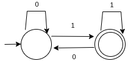
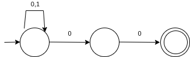
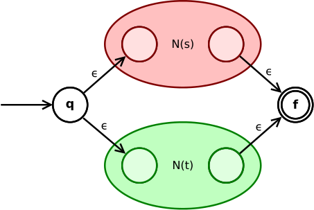
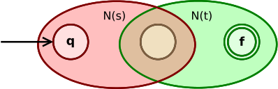
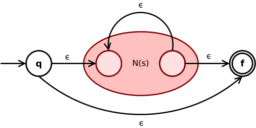

# Motivação

## Limitações do Analisador Ad-Hoc

- Difícil de manter e extender para linguagens maiores
- Como adicionar **identificadores**? Exige reestruturar o estado

## Limitações do Analisador Ad-Hoc

- Como suportar **comentários em bloco** (`/* */`)?
- Como garantir que a implementação está correta?

## Limitações do Analisador Ad-Hoc

- Pergunta: existe uma forma extensível e eficiente para construir analisadores?

## A Solução: Expressões Regulares + Autômatos

- Especificamos tokens como **expressões regulares** (declarativo)
- Geramos o analisador léxico **automaticamente** a partir dessa especificação

## A Solução: Expressões Regulares + Autômatos

- O analisador gerado é um **Autômato Finito Determinístico (AFD)**
- Garantias formais de correção e eficiência
- Teoria bem estabelecida: linguagens regulares

# Autômatos Finitos Determinísticos

## Definição Formal

Um AFD $M = (E, \Sigma, \delta, i, F)$:

- $E$: conjunto finito de **estados**
- $\Sigma$: **alfabeto** de entrada
- $\delta : E \times \Sigma \to E$: **função de transição** (determinística)
- $i \in E$: **estado inicial** único
- $F \subseteq E$: conjunto de **estados finais** (aceitação)

## Representação em Haskell

```haskell
data DFA a = DFA
  { start  :: a           -- estado inicial
  , delta  :: a -> Char -> a  -- função de transição
  , finals :: a -> Bool   -- predicado de estado final
  }
```

- Parametrizado pelo tipo `a` dos estados
- A função `finals` retorna `True` para estados finais
- Flexível: estados podem ser `Bool`, `Int`, `Set Int`, etc.

## Exemplo: AFD para Palavras Terminadas em `1`

{width=60%}

- Estado `False`: último caractere não foi `1` (ou início)
- Estado `True`: último caractere foi `1` (estado final)

## Implementação do AFD

```haskell
endsWithOne :: DFA Bool
endsWithOne = DFA False transition id
  where
    transition False '0' = False
    transition False '1' = True
    transition True  '0' = False
    transition True  '1' = True
    transition _     _   = False
```

- Estado inicial: `False`
- Função final: `id` (só `True` é estado final)
- Transições por casamento de padrões

## Execução e Aceitação

```haskell
-- Computa o estado final após processar toda a string
deltaStar :: DFA a -> String -> a
deltaStar m = foldl (delta m) (start m)

-- Verifica se uma string é aceita
accept :: DFA a -> String -> Bool
accept m s = finals m (deltaStar m s)
```

Exemplos:

- `accept endsWithOne "01"` → `True`
- `accept endsWithOne "10"` → `False`
- `accept endsWithOne "001"` → `True`

# Autômatos Finitos Não-Determinísticos

## Definição Formal

Um AFN $M = (E, \Sigma, \delta, I, F)$:

- $\delta : E \times \Sigma \to \mathcal{P}(E)$: transição para **conjunto** de
  estados
- $I \subseteq E$: **conjunto** de estados iniciais (pode haver vários)
- Um AFN aceita uma entrada se **algum** caminho leva a um estado final

## Representação em Haskell

```haskell
data NFA a = NFA
  { numberOfStates :: Int
  , nfaStart       :: Set a       -- estados iniciais
  , nfaDelta       :: a -> Char -> Set a  -- transição
  , nfaFinals      :: Set a       -- estados finais
  }
```

## Exemplo: AFD para Palavras Terminadas em `00`

{width=60%}

## Exemplo

```haskell
endsWith00 :: NFA Int
endsWith00 = NFA 3 (Set.singleton 0)
    (\ s c -> case (s,c) of
        (0, '0') -> Set.fromList [0,1]
        (0, '1') -> Set.singleton 0
        (1, '0') -> Set.singleton 2
        _        -> Set.empty)
    (Set.singleton 2)
```

## Conversão AFN -> AFD

- Seja $M = (E, \Sigma, \delta, I, F)$ um AFN.
- O AFD equivalente é:

$$M' = (\mathcal{P}(E),\, \Sigma,\, \delta',\, I,\, F')$$

## Conversão AFN -> AFD

- **Estados** do AFD: subconjuntos de estados do AFN
- **Estado inicial**: $I$ (conjunto de estados iniciais do AFN)
- **Estados finais**: $F' = \{X \mid X \cap F \neq \emptyset\}$
- **Transição**: $\delta'(X, a) = \bigcup_{q \in X} \delta(q, a)$

## Implementação

- O AFD resultante tem **estados do tipo `Set a`**
- A transição une os destinos de todos os estados do conjunto atual
- Um conjunto é final se contém algum estado final do AFN

## Implementação

```haskell
subset :: Ord a => NFA a -> DFA (Set a)
subset m = DFA
  { start  = nfaStart m
  , delta  = \es c ->
      Set.unions (map (flip (nfaDelta m) c) (Set.elems es))
  , finals = \es ->
      not (disjoint es (nfaFinals m))
  }
```

# Expressões Regulares

## Expressões Regulares

$$e \to \emptyset \mid \lambda \mid a \mid ee \mid e+e \mid e^*$$

- $\emptyset$: conjunto vazio (nunca casa)
- $\lambda$: palavra vazia
- $a$: símbolo do alfabeto
- $ee$: concatenação
- $e+e$: união (alternativa)
- $e^*$: fecho de Kleene (zero ou mais repetições)

## Semântica

$$\begin{array}{lcl}
L(\emptyset) &=& \emptyset \\
L(\lambda) &=& \{\lambda\} \\
L(a) &=& \{a\} \\
L(e_1 e_2) &=& L(e_1)L(e_2) \\
L(e_1 + e_2) &=& L(e_1) \cup L(e_2) \\
L(e^*) &=& L(e)^*
\end{array}$$

## Tipo Haskell para Expressões Regulares

```haskell
data Regex
  = Empty           -- ∅: conjunto vazio
  | Lambda          -- λ: palavra vazia
  | Chr Char        -- a: caractere específico
  | Regex :+: Regex -- e1 + e2: união
  | Regex :@: Regex -- e1 e2: concatenação
  | Star Regex      -- e*: fecho de Kleene
```

- Operadores infixos (`:+:`, `:@:`) refletem a notação matemática
- Construtores de dados representam diretamente a gramática

# Construção de Thompson

## A Ideia Central

- Converte ER em AFN por **recursão estrutural**
- Para cada construtor da ER, há um AFN correspondente

## A Ideia Central

- AFNs parciais são **compostos** para formar o AFN final
- Teorema: toda ER tem um AFN equivalente e vice-versa

## Caso Base: vazio

{width=30%}

$e = \emptyset$: AFN sem estados, aceita a linguagem vazia

## Caso Base: lambda

{width=30%}

$e = \lambda$: um único estado que é simultaneamente inicial e final

## Caso Base: Símbolo

{width=45%}

$e = a$: dois estados, transição sobre o símbolo $a$

## Caso Indutivo: União

{width=60%}

$e = s + t$: os AFNs $N(s)$ e $N(t)$ são colocados em **paralelo**

## Caso Indutivo: Concatenação

{width=65%}

$e = s\,t$: os AFNs $N(s)$ e $N(t)$ são colocados em **sequência**

## Caso Indutivo: Fecho de Kleene

{width=55%}

$e = s^*$: os estados finais de $N(s)$ retornam aos estados iniciais

## A Função `thompson` em Haskell

```haskell
thompson :: Regex -> NFA Int
thompson Empty = emptyNFA
thompson Lambda = lambdaNFA
thompson (Chr c) = chrNFA c
thompson (e1 :+: e2) = unionNFA (thompson e1) (thompson e2)
thompson (e1 :@: e2) = concatNFA (thompson e1) (thompson e2)
thompson (Star e1) = starNFA (thompson e1)
```

## Pipeline Completo: ER → AFD

```haskell
lexer :: [Regex] -> DFA (Set Int)
lexer = subset . foldr unionNFA emptyNFA . map thompson
```

1. `map thompson`: cada ER → AFN (via Thompson)
2. `foldr unionNFA emptyNFA`: combina todos os AFNs em um só
3. `subset`: converte o AFN combinado em um AFD

# Critério do Maior Prefixo

## O Problema

```
if (x > 0) ift = x + 1;
```

- `if` é uma palavra reservada
- `ift` é um identificador
- O analisador precisa reconhecer o **maior prefixo** que forma um token válido
- Sem esse critério: `ift` poderia ser lido como `if` + `t`

## Por que o Maior Prefixo é Necessário?

- Garante que tokens compostos sejam reconhecidos **atomicamente**
- Evita ambiguidades semânticas: `>=` não deve ser lido como `>` seguido de `=`

## Por que o Maior Prefix é Necessário?

- Padrão universal em compiladores: **maximal munch**
- Sem isso: `integer` poderia ser lido como `int` + `eger`

## Implementação

```haskell
longest :: DFA a -> String -> Maybe String
```

- Percorre a string mantendo o **último prefixo aceito** encontrado
- O acumulador é uma tripla: `(prefixo atual, melhor prefixo, estado atual)`

## Implementação

- Retorna `Nothing` se nenhum prefixo é aceito
- Retorna `Just s` com o maior prefixo aceito

## Lógica da Função `longest`

```haskell
longest m = combine . foldl step (Just "", Nothing, start m)
  where
    step (Just pre, last, e) c
      | finals m (delta m e c) =
          (Just (c:pre), Just (c:pre), delta m e c)
      | otherwise =
          (Just (c:pre), last, delta m e c)
    step (Nothing, val, e) c =
          (Nothing, val, delta m e c)
    combine (_, val, _) = reverse <$> val
```

# Derivadas de Expressões Regulares

## Motivação

- Thompson + subset pode ser computacionalmente custoso
- Bibliotecas comuns (Java, Perl) usam **backtracking**: tempo exponencial

## Motivação

- Derivadas de Brzozowski: abordagem alternativa eficiente
- Permite construir AFD diretamente da ER, sem AFN intermediário

## A Ideia de Brzozowski

A **derivada** $\partial(e, a)$ de uma ER $e$ em relação a um símbolo $a$ é a ER
que aceita o **restante** da entrada após consumir $a$:

$$L(\partial(e, a)) = \{w \mid aw \in L(e)\}$$

## Exemplos

- Se $e$ aceita `"abc"`, então $\partial(e, \text{'a'})$ aceita `"bc"`
- Podemos construir o AFD computando derivadas sucessivas

## Anulabilidade

Uma ER é **anulável** se $\lambda \in L(e)$:

$$\begin{array}{lcl}
\nu(\emptyset) &=& \bot \\
\nu(\lambda) &=& \top \\
\nu(a) &=& \bot \\
\nu(e_1 e_2) &=& \nu(e_1) \land \nu(e_2) \\
\nu(e_1 + e_2) &=& \nu(e_1) \lor \nu(e_2) \\
\nu(e^*) &=& \top
\end{array}$$

## Implementação

```haskell
nullable :: Regex -> Bool
nullable Empty       = False
nullable Lambda      = True
nullable (Chr _)     = False
nullable (e1 :+: e2) = nullable e1 || nullable e2
nullable (e1 :@: e2) = nullable e1 && nullable e2
nullable (Star _)    = True
```

## Regras de Derivada

$$\begin{array}{lcl}
\partial(\emptyset, a) &=& \emptyset \\
\partial(\lambda, a) &=& \emptyset \\
\partial(b, a) &=& \begin{cases} \lambda & \text{se } a = b \\ \emptyset & \text{c.c.} \end{cases} \\
\partial(e_1 + e_2, a) &=& \partial(e_1,a) + \partial(e_2,a) \\
\partial(e_1 e_2, a) &=& \begin{cases} \partial(e_1,a)\,e_2 + \partial(e_2,a) & \text{se } \nu(e_1) \\ \partial(e_1,a)\,e_2 & \text{c.c.} \end{cases} \\
\partial(e^*, a) &=& \partial(e,a)\,e^*
\end{array}$$

## Implementação

```haskell
deriv :: Char -> Regex -> Regex
deriv _ Empty  = Empty
deriv _ Lambda = Empty
deriv a (Chr b)
  | a == b    = Lambda
  | otherwise = Empty
deriv a (e1 :+: e2) = deriv a e1 .+. deriv a e2
deriv a (e1 :@: e2)
  | nullable e1 = deriv a e1 .@. e2 .+. deriv a e2
  | otherwise   = deriv a e1 .@. e2
deriv a (Star e1) = deriv a e1 .@. star e1
```

## Simplificações Necessárias

Para que o conjunto de derivadas seja **finito**, aplicamos simplificações:

$$\begin{array}{ccc}
e_1 + \emptyset \equiv e_1 &
\emptyset + e_2 \equiv e_2 &
e_1 \emptyset \equiv \emptyset \\
\emptyset e_2 \equiv \emptyset &
e_1 \lambda \equiv e_1 &
\lambda e_2 \equiv e_2 \\
\lambda^* \equiv \lambda &
\emptyset^* \equiv \lambda &
(e^*)^* \equiv e^*
\end{array}$$

## Simplificações

```haskell
(.+.) :: Regex -> Regex -> Regex
Empty .+. e' = e'
e .+. Empty  = e
e .+. e'     = e :+: e'
```

## AFD via Derivadas

- **Estados**: expressões regulares alcançáveis por derivação
- **Transição**: $\delta(e, a) = \partial(e, a)$
- **Estados finais**: expressões anuláveis (aceitam $\lambda$)
- O conjunto de estados é sempre **finito** (com simplificações)

## AFD via Derivadas

```haskell
derivDFA :: Regex -> DFA Regex
derivDFA e = DFA
  { start  = simp e
  , delta  = \state c -> deriv c state
  , finals = nullable
  }
```

# Conclusão

## Conclusão

- **AFDs**: reconhecem linguagens regulares eficientemente
- **AFNs**: facilitam a construção por composição (Thompson)

## Conclusão

- **Thompson**: converte ER em AFN por recursão estrutural
- **Subset**: converte AFN em AFD equivalente

## Conclusão

- **Critério do maior prefixo**: resolve ambiguidades léxicas
- **Derivadas de Brzozowski**: constroem AFD diretamente da ER
