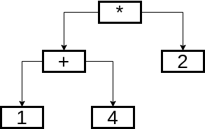

# Objetivos

## Objetivos

- Motivar o uso de gramáticas livres de contexto para especificação da estrutura
  sintática de linguagens.

- Revisar alguns conceitos sobre linguagens livres de contexto.

- Apresentar problemas comuns na modelagem de sintaxe usando gramáticas.

# Introdução

## O Papel da Análise Sintática

- Após a análise léxica, o programa é uma **lista de tokens**
- A análise sintática verifica se os tokens formam uma **estrutura válida**
- Produz uma **Árvore Sintática Abstrata (AST)**

## O Papel da Análise Sintática

- Não verifica tipos, declarações de variáveis, etc. (papel da análise
  semântica)
- A AST é usada pelas fases seguintes do compilador

## Por que não ERs?

- Parênteses balanceados requerem **contar** indefinidamente
- Autômatos finitos têm um número **fixo** de estados
- Impossível contar número ilimitado de parênteses abertos com AFD

## Por que não ERs?

- Lema do Bombeamento: $\{a^n b^n \mid n \geq 0\}$ não é regular
- **Solução**: Gramáticas Livres de Contexto (GLCs)

# Gramáticas Livres de Contexto

## Definição Formal

Uma GLC $G = (V, \Sigma, R, P)$:

- $V$: conjunto de **não-terminais** (variáveis sintáticas)
- $\Sigma$: conjunto de **terminais** (tokens)
- $R$: conjunto de **produções** da forma $A \to \alpha$
- $P \in V$: **símbolo inicial**

## Exemplo: Linguagem Exp

$$E \to n \mid E + E \mid E * E \mid (E)$$

- $\Sigma = \{+, *, (, ), n\}$ são os tokens da linguagem
- $V = \{E\}$ é o único não-terminal
- Derivamos strings aplicando produções repetidamente

## Derivações

- Uma string pertence a $L(G)$ se existe uma **derivação** a partir do símbolo
  inicial:

$$
\begin{array}{l}
   E \Rightarrow E+E \Rightarrow \\
  (E)+E \Rightarrow (E+E)+E \Rightarrow \\
  (1+E)+E \Rightarrow (1+4)+E \Rightarrow\\
  (1+4)+2
\end{array}
$$

## Derivações

- Cada passo aplica uma produção:
  - Forma sentencial atual: $\alpha A \beta$
  - Regra $A \to \gamma$
  - Resultado: $\alpha A \beta \to \alpha \gamma \beta$

## Derivações

- **Derivação mais à esquerda**: expande o não-terminal mais à esquerda
- **Derivação mais à direita**: expande o mais à direita

## Exemplo

- Derivação Mais à Esquerda de `(1+4)+2`

$$\begin{array}{lc}
E     & \Rightarrow \\
E + E & \Rightarrow \\
(E) + E & \Rightarrow \\
(E + E) + E & \Rightarrow \\
(1 + E) + E & \Rightarrow \\
(1 + 4) + E & \Rightarrow \\
(1 + 4) + 2
\end{array}$$

## Exemplo

- Derivação Mais à Direita de `(1+4)+2`

$$\begin{array}{lc}
E     & \Rightarrow \\
E + E & \Rightarrow \\
E + 2 & \Rightarrow \\
(E) + 2 & \Rightarrow \\
(E + E) + 2 & \Rightarrow \\
(E + 4) + 2 & \Rightarrow \\
(1 + 4) + 2
\end{array}$$

Ambas as derivações correspondem à mesma árvore sintática.

# Ambiguidade

## Ambiguidade

- Uma gramática é **ambígua** se alguma string tem **mais de uma árvore
  sintática**
- A gramática $E \to n \mid E+E \mid E*E \mid (E)$ é ambígua!
- Para `2 + 3 * 4`:

## Duas Árvores

- Árvore 1: raiz é $E+E$ → calcula $(2+3)*4 = 20$ (errado!)
- Árvore 2: raiz é $E*E$ → calcula $2+(3*4) = 14$ (correto)
- Ambiguidade causa resultados diferentes dependendo da interpretação

## Solução

- Hierarquia de Precedência

$$\begin{array}{lcl}
E &\to& E + T \mid T \\
T &\to& T * F \mid F \\
F &\to& n \mid (E)
\end{array}$$

## Solução

- $E$ (Expressão): somas
- $T$ (Termo): produtos
- $F$ (Fator): átomos e expressões parentesadas
- Multiplicação tem **maior precedência** que adição

## Precedência

- Expressão de precedência $i+1$
  - Associatividade à direita

$$
E_{i + 1} \to E_i \otimes E_{i + 1}
$$

## Precedência

- Expressão de precedência $i+1$
  - Associatividade à esquerda

$$
E_{i + 1} \to E_{i + 1} \otimes E_i
$$

## Precedência

- A produção $E \to E+T$ impede que soma apareça **dentro** de um produto sem
  parênteses
- A associatividade à esquerda vem da recursão à esquerda: $E \to E+T$

## Precedência

- Para recursão à direita: $E \to T+E$
- A gramática agora tem **uma única árvore** para cada string

## O Problema do Else

$$\begin{array}{lcl}
S &\to& \mathbf{if}\; E\; \mathbf{then}\; S \\
  &\mid& \mathbf{if}\; E\; \mathbf{then}\; S\; \mathbf{else}\; S \\
  &\mid& \mathbf{other}
\end{array}$$

## O Problema do Else

Para `if E1 then if E2 then S1 else S2`:

- O `else` pertence ao primeiro `if` ou ao segundo?
- **Regra convencional**: `else` liga ao `if` mais próximo

## Solução do Else

- Introduzindo não-terminais para instruções correspondentes e
  não-correspondentes:

$$\begin{array}{lcl}
M &\to& \mathbf{if}\; E\; \mathbf{then}\; M\; \mathbf{else}\; M \mid \mathbf{other}\\
U &\to& \mathbf{if}\; E\; \mathbf{then}\; S \\
  &\mid& \mathbf{if}\; E\; \mathbf{then}\; M\; \mathbf{else}\; U
\end{array}$$

# Transformações de Gramática

## Remoção de Recursão à Esquerda

- Parsers descendentes entram em **loop infinito** com recursão à esquerda:

$$A \to A\,\alpha_1 \mid \cdots \mid A\,\alpha_m \mid \beta_1 \mid \cdots \mid \beta_n$$

## Remoção de Recursão à Esquerda

- Transformação — introduz novo não-terminal $A'$:

$$\begin{array}{lcl}
A  &\to& \beta_1\;A' \mid \beta_2\;A' \mid \cdots \mid \beta_n\;A' \\
A' &\to& \alpha_1\;A' \mid \alpha_2\;A' \mid \cdots \mid \alpha_m\;A' \mid \lambda
\end{array}$$

## Exemplo

- Gramática original (recursão à esquerda):

$$\begin{array}{lcl}
E &\to& E + T \mid T \\
T &\to& T * F \mid F
\end{array}$$

## Exemplo

- Após transformação:

$$\begin{array}{lcl}
E  &\to& T\;E' \\
E' &\to& +\;T\;E' \mid \lambda \\
T  &\to& F\;T' \\
T' &\to& *\;F\;T' \mid \lambda \\
F  &\to& n \mid (\;E\;)
\end{array}$$

## Recursão Indireta à Esquerda

- Também é possível ter recursão à esquerda **indireta**:

$$\begin{array}{lcl}
A &\to& B\,a \\
B &\to& A\,b \mid c
\end{array}$$

## Recursão Indireta à Esquerda

- Porque $A \Rightarrow B\,a \Rightarrow A\,b\,a$ — recursão indireta.

- Algoritmo geral: ordenar os não-terminais e eliminar sistematicamente as
  produções $A_i \to A_j\,\alpha$ para $j < i$.

## Fatoração à Esquerda

- Quando duas produções compartilham um prefixo, o parser não sabe qual escolher
  com 1 token de lookahead:

$$S \to \mathbf{if}\; E\; \mathbf{then}\; S\; \mathbf{else}\; S \mid \mathbf{if}\; E\; \mathbf{then}\; S$$

## Fatoração à Esquerda

- Fatorando o prefixo comum $\mathbf{if}\; E\; \mathbf{then}\; S$:

$$\begin{array}{lcl}
S  &\to& \mathbf{if}\; E\; \mathbf{then}\; S\; S' \\
S' &\to& \mathbf{else}\; S \mid \lambda
\end{array}$$

## Padrão Geral de Fatoração

Dado:

$$A \to \alpha\,\beta_1 \mid \alpha\,\beta_2 \mid \cdots \mid \alpha\,\beta_k \mid \gamma_1 \mid \cdots$$

## Padrão Geral de Fatoração

- Após fatoração:

$$\begin{array}{lcl}
A  &\to& \alpha\;A' \mid \gamma_1 \mid \cdots \\
A' &\to& \beta_1 \mid \beta_2 \mid \cdots \mid \beta_k
\end{array}$$

- O analisador consome $\alpha$ e depois decide com base no próximo token

# Árvores Sintáticas Abstratas

## AST vs. Árvore de Derivação

- **Árvore de derivação**: descreve os passos da derivação, inclui todos os nós

## AST vs. Árvore de Derivação

- **AST**: apenas as construções relevantes para fases seguintes
  - Sem parênteses (já capturados pela estrutura da árvore)
  - Sem não-terminais auxiliares ($E'$, $T'$, etc.)

## Exemplo de AST para `(1+4)*2`

{width=55%}

- Parênteses determinam a estrutura mas não aparecem na AST
- Nós internos: operadores; folhas: literais inteiros

## Tipo Haskell para a AST

```haskell
data Exp
  = EInt Int        -- literal inteiro
  | Exp :+: Exp     -- adição
  | Exp :*: Exp     -- multiplicação
```

- Um construtor por construção da linguagem relevante
- Construtores infixos refletem a natureza binária dos operadores
- Em Haskell, é conveniente usar **tipos algébricos** para ASTs

## Outros Desafios na Análise Sintática

- **Indentação significativa** (Python, Haskell): o lexer insere tokens de
  indentação/desindentação.

## Outros Desafios na Análise Sintática

- **Identificadores dependentes de contexto** (C++): `HashTable<K,V> x;` pode
  ser ambíguo
  - Depende se `HashTable` é um tipo ou uma variável
  - Requer feedback do analisador semântico para o léxico

# Conclusão

## Conclusão

- **GLCs** permitem especificar estruturas recursivas que ERs não conseguem
- **Derivações** mostram como strings são geradas pela gramática

## Conclusão

- **Ambiguidade** é resolvida com hierarquias de precedência e associatividade
- **Remoção de recursão à esquerda**: prepara a gramática para parsers
  descendentes.

## Conclusão

- **Fatoração à esquerda**: elimina ambiguidades de escolha com 1 lookahead
- **ASTs**: representação compacta do programa para fases seguintes
