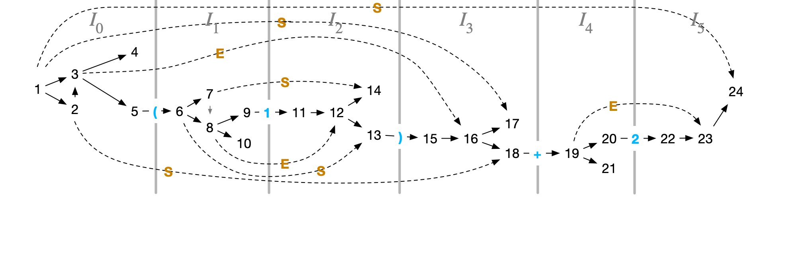
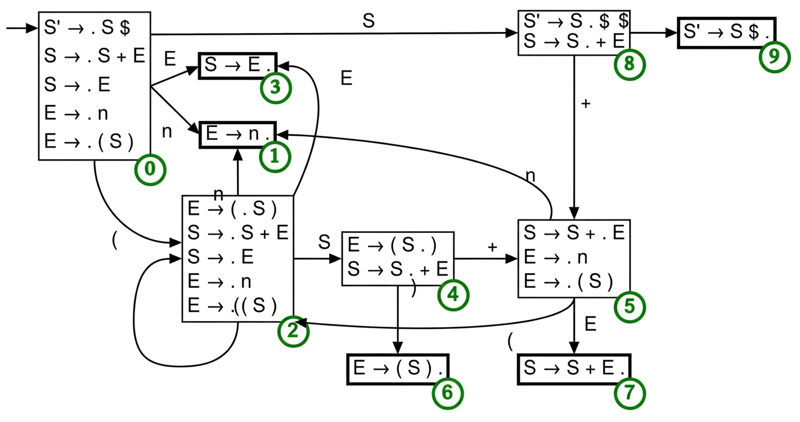

# Objetivos

## Objetivos

- Apresentar a estratégia de análise bottom-up

- Apresentar 3 algoritmos: Earley, LR(0) e SLR.

# Motivação

## Limitações: Top-Down

- Analisadores **LL** exigem transformações na gramática
  - Remoção de recursão à esquerda
  - Fatoração à esquerda

## Limitações: Top-Down

- Decisão com apenas **1 token de lookahead**
- Algumas gramáticas são inerentemente não-LL(1)

## A Ideia Bottom-Up

- Analisadores **bottom-up** lêem um prefixo maior antes de decidir
- Suportam **recursão à esquerda** naturalmente

## A Ideia Bottom-Up

- Constroem uma **derivação mais à direita invertida**
- Cada redução constrói um pedaço da árvore sintática

## Der. à Direita Invert.

Gramática de exemplo (não-LL(1)):

$$\begin{array}{lcl}
S &\to& S + E \mid E \\
E &\to& (S) \mid n
\end{array}$$

## Der. à Direita Invert.

Analisando `(1) + 2`:

```
S'  =>  S  =>  S+E  =>  S+2  =>  E+2  →  (S)+2  =>  (E)+2  =>  (1)+2
```

O analisador constrói essa derivação de baixo para cima, da direita para a
esquerda.

# Algoritmo de Earley

## A Ideia Central

- Simula **todas as análises possíveis** em paralelo
- Em vez de se comprometer com uma produção, prevê todas
- Usa **compartilhamento de trabalho** para eficiência polinomial
- Processa cada posição de entrada $j$ mantendo um conjunto $I_j$ de **itens**

## Itens Earley

Um item Earley $[A \to \beta . \gamma, k]$ representa:

- $A \to \beta\gamma$: produção sendo usada
- $.$ (ponto): posição atual no reconhecimento
- $k$: posição na entrada onde o reconhecimento de $A$ começou

## Exemplos

- $[E \to . (S), 0]$: começamos a reconhecer $E \to (S)$ na posição 0, nada
  visto ainda
- $[E \to ( S . ), 0]$: vimos `(S`, esperamos `)`
- $[E \to (S) ., 0]$: $E$ completamente reconhecida a partir da posição 0

## Algoritmo de Earley

**Inicialização:** $I_0 = \{[S' \to . S, 0]\}$

## Algoritmo de Earley

1. **Predição**: se $[A \to \alpha . B \beta, k] \in I_j$ e $B \to \gamma$ é uma
   produção, adiciona $[B \to . \gamma, j]$ a $I_j$

## Algoritmo de Earley

2. **Verificar (scan)**: se $[A \to \alpha . a \beta, k] \in I_j$ e o token
   atual é $a$, adiciona $[A \to \alpha\, a . \beta, k]$ a $I_{j+1}$

## Algoritmo de Earley

3. **Completar**: se $[B \to \gamma ., k] \in I_j$, para cada
   $[A \to \alpha . B \beta, l] \in I_k$, adiciona
   $[A \to \alpha\, B . \beta, l]$ a $I_j$

## Algoritmo de Earley

**Aceita:** se $[S' \to S ., 0] \in I_n$

## Exemplo: Análise de `(1) + 2`

Gramática: $S \to S+E \mid E$ e $E \to (S) \mid n$

| Conjunto | Item          | Pos | Motivo     |
| -------- | ------------- | --- | ---------- |
| $I_0$    | $S' \to . S$  | 0   | inicial    |
|          | $S \to . S+E$ | 0   | prever $S$ |
|          | $S \to . E$   | 0   | prever $S$ |
|          | $E \to . n$   | 0   | prever $E$ |
|          | $E \to . (S)$ | 0   | prever $E$ |

## Exemplo: Análise de `(1) + 2`

Gramática: $S \to S+E \mid E$ e $E \to (S) \mid n$

| Conjunto | Item            | Pos | Motivo       |
| -------- | --------------- | --- | ------------ |
| $I_1$    | $E \to ( . S )$ | 0   | consumir `(` |
|          | $S \to . S+E$   | 1   | prever $S$   |
|          | $S \to . E$     | 1   | prever $S$   |
|          | $E \to . n$     | 1   | prever $E$   |
|          | $E \to . (S)$   | 1   | prever $E$   |

## Exemplo: Análise de `(1) + 2` (continuação)

| Conjunto | Item           | Pos | Motivo        |
| -------- | -------------- | --- | ------------- |
| $I_2$    | $E \to n .$    | 1   | consumir `1`  |
|          | $S \to E .$    | 1   | completar $E$ |
|          | $E \to (S . )$ | 0   | completar $S$ |
|          | $S \to S . +E$ | 1   | completar $S$ |

## Exemplo: Análise de `(1) + 2` (continuação)

| Conjunto | Item           | Pos | Motivo        |
| -------- | -------------- | --- | ------------- |
| $I_3$    | $E \to (S) .$  | 0   | consumir `)`  |
|          | $S \to E .$    | 0   | completar $E$ |
|          | $S' \to S .$   | 0   | completar $S$ |
|          | $S \to S . +E$ | 0   | completar $S$ |

## Exemplo: Análise de `(1) + 2` (continuação)

| Conjunto | Item           | Pos | Motivo                      |
| -------- | -------------- | --- | --------------------------- |
| $I_4$    | $S \to S+ . E$ | 0   | consumir `+`                |
|          | $E \to . n$    | 4   | prever $E$                  |
| $I_5$    | $E \to n .$    | 4   | consumir `2`                |
|          | $S \to S+E .$  | 0   | completar $E$               |
|          | $S' \to S .$   | 0   | completar $S$: **sucesso!** |

## Visualização do Algoritmo de Earley

{width=70%}

## Complexidade

- **Pior caso geral**: $O(n^3)$ — inclui gramáticas ambíguas
- **Gramáticas não-ambíguas**: $O(n^2)$ no pior caso
- **Gramáticas LL/LR**: $O(n)$ quando implementado cuidadosamente

## Vantagens

- Analisa **qualquer GLC**, incluindo ambíguas
- Sem necessidade de transformar a gramática
- Otimização de Aycock-Horspool: apenas 50% mais lento que LALR

# Analisadores LR: Shift-Reduce

## A Ideia Shift-Reduce

LR pode ser visto como uma **otimização do Earley**:

- As previsões são **pré-computadas** como estados de um autômato

## A Ideia Shift-Reduce

- Estado do analisador: uma **pilha de estados**
- Duas ações: **shift** (consumir token) e **reduce** (aplicar produção)

## A Ideia Shift-Reduce

Em qualquer ponto:
$\underbrace{\alpha}_{\text{pilha}} \cdot \underbrace{\beta}_{\text{entrada}}$ é
uma forma sentencial direita

## Trace Shift-Reduce para `(1)+2`

| Pilha | Entrada | Ação             |
| ----- | ------- | ---------------- |
|       | `(1)+2` | shift            |
| `(`   | `1)+2`  | shift            |
| `(1`  | `)+2`   | reduce $E \to n$ |

## Trace Shift-Reduce para `(1)+2`

| Pilha | Entrada | Ação             |
| ----- | ------- | ---------------- |
| `(1`  | `)+2`   | reduce $E \to n$ |
| `(E`  | `)+2`   | reduce $S \to E$ |
| `(S`  | `)+2`   | shift            |

## Trace Shift-Reduce para `(1)+2`

| Pilha | Entrada | Ação             |
| ----- | ------- | ---------------- |
| `E`   | `+2`    | reduce $S \to E$ |
| `S`   | `+2`    | shift            |
| `S+`  | `2`     | shift            |

## Trace Shift-Reduce para `(1)+2`

| Pilha | Entrada | Ação               |
| ----- | ------- | ------------------ |
| `S+2` | `$`     | reduce $E \to n$   |
| `S+E` | `$`     | reduce $S \to S+E$ |
| `S`   | `$`     | **aceitar**        |

## Decisão: Quando Shift ou Reduce?

- O analisador precisa decidir quando olha o topo da pilha e o próximo token.

## Decisão: Quando Shift ou Reduce?

- Para isso, usamos um **autômato LR(0)** cujos estados são conjuntos de itens
  - Os estados capturam exatamente o que já foi reconhecido
  - A tabela de ações mapeia (estado, token) → shift ou reduce

# LR(0): Itens e Autômato

## Itens LR(0)

Um item LR(0) $A \to \alpha . \beta$ (sem lookahead):

- $\alpha$: já reconhecido (no topo da pilha)
- $\beta$: o que ainda é esperado

## Estados LR(0)

Um **estado LR(0)** é um conjunto fechado de itens.

```haskell
data Item = Item
  { itemLHS    :: String    -- A: não-terminal
  , itemBefore :: [Symbol]  -- α: antes do ponto
  , itemAfter  :: [Symbol]  -- β: depois do ponto
  }


type State = Set Item
```

## Fechamento (Closure)

Para cada item $[A \to \alpha . B \beta]$ com não-terminal $B$ após o ponto,
adicionar todos $[B \to . \gamma]$:

```haskell
closure :: Grammar -> State -> State
closure g = fixedPoint step
  where
    step current = Set.union current $ Set.fromList
        [ Item b [] prod
        | item <- Set.toList current
        , NonTerminal b <- take 1 (itemAfter item)
        , prod <- fromMaybe [] (Map.lookup b g)
        ]
```

## Função Goto

Avança o ponto ao consumir o símbolo $X$ e fecha o resultado:

```haskell
goto :: Grammar -> State -> Symbol -> State
goto g items sym = closure g $ Set.fromList
    [ Item lhs (before ++ [sym]) rest
    | Item lhs before (s:rest) <- Set.toList items
    , s == sym
    ]
```

## O Autômato LR(0)

- Resolução na lousa.

{width=70%}

## Regras de Preenchimento LR(0)

- **Shift**: para terminal $t$ após o ponto em item do estado $i$:
  - `action[i, t] = Shift j` onde $j$ = índice de `goto(i, t)`

## Regras de Preenchimento LR(0)

- **Reduce (LR0)**: para item completo $A \to \alpha .$ no estado $i$:
  - `action[i, t] = Reduce(A → α)` para **todos** os terminais $t$
  - LR(0) ignora completamente o lookahead nas reduções!

## Regras de Preenchimento LR(0)

- **Accept**: quando o item completo é $S' \to S .$:
  - `action[i, $] = Accept`

# SLR: Simple LR

## O Problema do LR(0)

LR(0) ignora o lookahead → gera muitos conflitos shift-reduce

**Exemplo:** gramática com recursão à direita

$$E \to T + E \mid T \quad T \to n \mid (E)$$

## O Problema do LR(0)

- Estado com $E \to T .$ e $E \to T . + E$:

- Item completo $E \to T .$ → LR(0) insere reduce em **todos** os terminais,
  inclusive `+`
- Item $E \to T . + E$ → exige shift em `+`
- **Conflito!**

## A Solução SLR

**Ideia**: reduzir $A \to \alpha$ faz sentido apenas quando o próximo token pode
seguir $A$ na gramática

$$\text{reduce apenas em } t \in \mathrm{FOLLOW}(A)$$

## A Solução SLR

Para $E \to T .$ com $\mathrm{FOLLOW}(E) = \{\$, )\}$:

- LR(0): insere reduce em todos os terminais (inclusive `+`)
- SLR: insere reduce apenas em `$` e `)` — sem conflito com shift em `+`!

## Exemplo SLR

$$\begin{array}{lcl}
E &\to& E + T \mid T \\
T &\to& T * F \mid F \\
F &\to& (E) \mid n
\end{array}$$

## Exemplo SLR

Estado com $E \to T.$ e $T \to T . * F$:

- LR(0): conflito shift-reduce em `*` (reduce $E \to T$ e shift de `*`)
- SLR: $* \notin \mathrm{FOLLOW}(E) = \{+, ), \$\}$
  - `action[estado, *]` recebe apenas Shift — **sem conflito!**

# Conclusão

## Conclusão

- **Análise bottom-up** é mais expressiva que top-down
  - Suporta recursão à esquerda
  - Decisão após prefixo maior

## Conclusão

- **Earley**: analisa qualquer GLC, $O(n^3)$ no pior caso
- **LR(0)**: autômato de estados × itens, tabela de ações/goto
- **SLR**: melhora LR(0) restringindo reduces a $\mathrm{FOLLOW}(A)$
